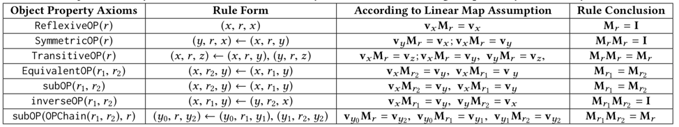
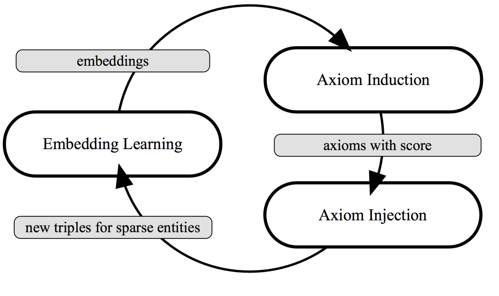
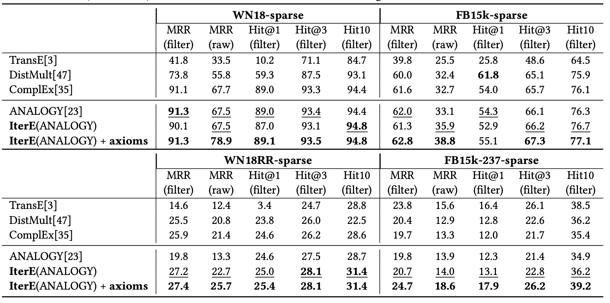
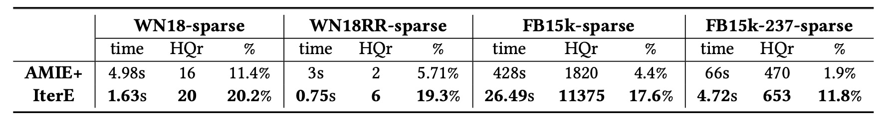
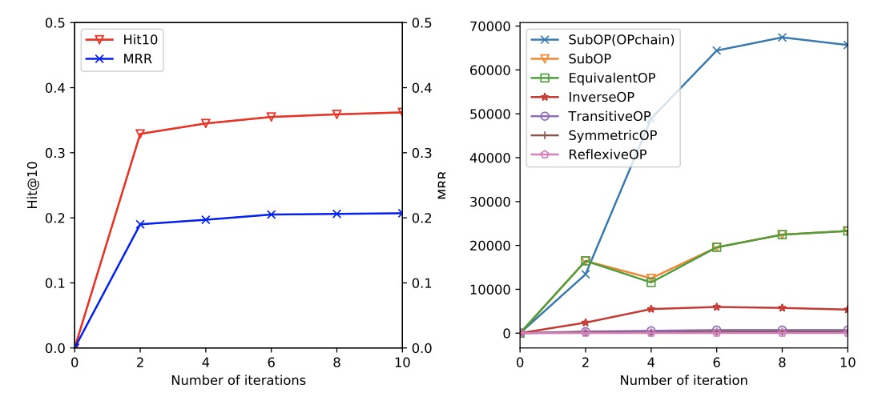

[**中文**](https://github.com/zjunlp/OntoED/blob/master/README_CN.md) | [**English**](https://github.com/zjunlp/OntoED/)

<p align="center">
  	<font size=6><strong>IterE:可以交替进行规则和嵌入表示学习的知识图谱推理方法。</strong></font>
</p>


这是针对我们论文 **[Iteratively Learning Embeddings and Rules for Knowledge Graph Reasoning](https://dl.acm.org/doi/10.1145/3308558.3313612)**的官方简介，目前论文已被 **WWW 2019** 主会录用。

```
Wen Zhang, Bibek Paudel, Liang Wang, Jiaoyan Chen, Hai Zhu, Wei Zhang, Abraham Bernstein, Huajun Chen. Iteratively learning embeddings and rules for knowledge graph reasoning. (CCF A). 
```


# 论文简介

本文是我们与苏黎世大学以及阿里巴巴合作的工作，发表于WWW2019，这篇工作将知识图谱推理的两种典型方法，即表示学习和规则进行了结合，提出了IterE，并实现了两者的优势互补。


### 摘要

推理可以帮助知识图谱补全以及知识图谱的冲突检测，能够有效帮助提升知识图谱的质量。目前知识图谱推理的典型方法有两种，一种是表示学习方法，将知识图谱中的元素映射到连续的向量空间并通过向量空间中的计算完成推理，一种是规则挖掘方法，挖掘知识图谱中存在的逻辑规则，然后利用规则进行推理。表示学习方法通过模型计算自动完成推理，在大规则知识图谱上有较好的优势，规则由于其符号表示特性对人较友好和推理结果的可解释性较强，但两者都存在各自的缺点，其中表示学习方法对稀疏的实体无法学到较好的向量表示因而预测结果较差，而传统基于图遍历搜索的规则挖掘方法在大规模知识图谱上会遇到明显的效率问题。本文提出了一个方法将表示学习和规则挖掘结合在一起，互相弥补各自的瓶颈。


### 模型

本文结合表示学习和规则挖掘的思路建立于我们发现了基于线性变换假设的表示学习模型对于规则挖掘具有很好的友好性，线性变换假设即将一个知识图谱中的三元组(h,r,t)中的头尾实体h和t表示为向量**h**和**t**并将关系r表示为矩阵**M**r，且假设对于正确的三元组满足 **hM**r=**t**。本文的规则类型参考了OWL2中的定义，选择了7种类型的规则，对于这7种规则，从线性变换假设中我们都可以得出一个特殊的结论如下表所示：



上表中的rule conclusion是本文从表示学习结果中学习规则的重要依据。


下面介绍本文的核心想法，如下图所示：



主要包含三个模块，Embedding Learning 模块，Axiom Induction 模块，以及Axiom Injection 模块，下面分别简单介绍一个这三个模块的核心功能：

*  Embedding Learning模块：通过知识图谱中存在的三元组以及规则推理出的三元组进行知识图谱的表示学习，本文采用的是基于线性变换假设的表示学习模型ANALOGY。 
* Axiom Induction模块：通过Embedding Learning模块学到的表示结果参考上文介绍的7种规则所对应的结论计算出置信度较高的规则。为了提高规则计算的效率，本文还设计了一个潜在规则集合的生成策略来有效地生成候选规则池。
* Axiom Injection模块：根据Axiom Induction模块生成的规则集合为稀疏的实体推理出新的三元组并添加到知识图谱中以减小其对应的实体稀疏度，并为每一个新生成的三元组标上合适的真值标签。最后将添加了新的三元组的知识图谱再次送到Embedding Learning模块中以更新表示学习的结果。

从上面的介绍中可以看出，本文提出的方法是一个迭代进行表示学习和规则挖掘并进行互相增强的过程，所以我们将本文提出的方法命名为IterE。

### 实验

我们在4个数据集上对IterE的进行了实验，并主要验证了以下三件事情：

* 通过链接预测的实验我们证明了规则确实帮助提升了稀疏实体预测结果，实验结果如下：

  

* 通过表示学习确实提升了规则挖掘的效率，规则挖掘的效率和质量结果如下所示：

  

* 在逐步迭代的过程中，表示学习结果和规则挖掘结果都实现了逐步增强，证明了迭代策略的有效性，结果如下：



# 使用代码

### 环境要求

本项目是基于Tensorflow 1.X 版本开发的。

### 运行代码

请运行以下命令来训练和测试项目模型：

```
python3 main.py --device /gpu --datadir ./datasets/FB15k-237-sparse --batch_size 2048 --dim 200 --test_batch_size 50 --max_epoch 100 --test_per_iter 100 --num_test 3000 --axiom_weight 0.1 --optimize Adam --lr 0.001 --neg_samples 2 --regularizer_weight 0.00001 --save_dir ./save/0825AE1 --update_axiom_per 1 --axiom_probability 0.95 --triple_generator 3
```

## 如何引用

如果您使用或扩展我们的工作，请引用以下文章：

```
@inproceedings{IterE,
  author    = {Wen Zhang and
               Bibek Paudel and
               Liang Wang and
               Jiaoyan Chen and
               Hai Zhu and
               Wei Zhang and
               Abraham Bernstein and
               Huajun Chen},
  title     = {Iteratively Learning Embeddings and Rules for Knowledge Graph Reasoning},
  booktitle = {{WWW}},
  pages     = {2366--2377},
  publisher = {{ACM}},
  year      = {2019}
}
```
